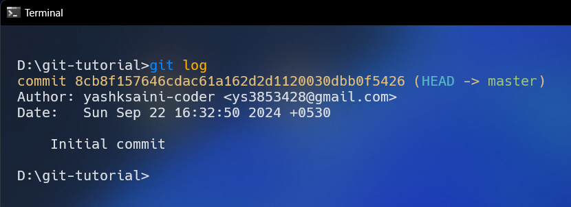
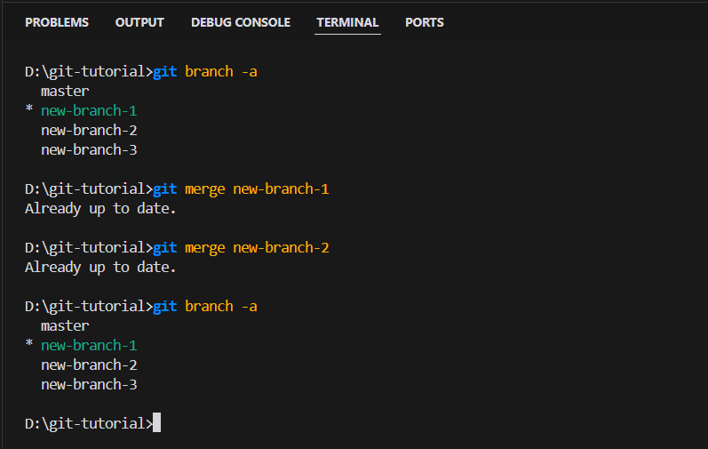

<div style="text-align: center;">
    
</div>
<br>

# Git

Git is a distributed version control system that allows you to track changes to your code and collaborate with others. It is widely used in the software development industry and is an essential tool for any developer.

## Table of Contents

1. [What is Git?](#what-is-git)
2. [Install Git](#install-git)
   - [Windows](#windows)
   - [macOS](#macos)
   - [Linux](#linux)
     - [Ubuntu](#ubuntu)
     - [Fedora](#fedora)
     - [Arch Linux](#arch-linux)
   - [Verify Installation](#verify-installation)
   - [Configure Name and Email](#configure-name-and-email)
4. [Repositories](#repositories)
   - [Local Repository](#local-repository)
   - [Remote Repository](#remote-repository)
5. [Creating a Git Repository](#creating-a-git-repository)
6. [Committing and Staging](#committing-and-staging)
   - [Understanding Commits](#understanding-commits)
   - [When to Commit](#when-to-commit)
   - [The Staging Area](#the-staging-area)
   - [Example Workflow](#example-workflow)
   - [Best Practices](#best-practices)
7. [History](#history)
   - [Viewing Commit History](#viewing-commit-history)
   - [Switching Between Commits](#switching-between-commits)
8. [Remove a file from staging](#remove-a-file-from-staging)
9. [Reverting Commits](#reverting-commits)
   - [Reverting a Single Commit](#reverting-a-single-commit)
   - [Reverting a Range of Commits](#reverting-a-range-of-commits)
10. [Branches](#branches)
    - [Creating a New Branch](#creating-a-new-branch)
    - [Switching Between Branches](#switching-between-branches)
    - [Merging Branches](#merging-branches)
    - [Removing a Branch](#removing-a-branch)
    - [List all branches](#list-all-branches)
    - [Branch Protection Rules](#branch-protection-rules)
      - [Setting Up Branch Protection](#setting-up-branch-protection)

---

## What is Git?

1. **Definition**: **Git** is a popular tool for work coordination and project management among people and teams. Knowing how to utilize Git is, without a doubt, one of the most crucial abilities for every developer and a solid asset to your career!

2. **Purpose**: The main purpose of Git is to keep track of changes made to files and coordinate work on those files among multiple people. Git ensures that your work is safe, and you can always revert to a previous version if needed.

3. **Usage**: Git is used for tracking changes in source code during software development. It is widely adopted in both open-source and private projects, providing a reliable method to collaborate on code across teams and time zones.


## Install Git

> ### Windows

For Windows, you can install Git from the [official website](https://git-scm.com/download/win).

<br>

> ### macOS

Git is typically installed by default on macOS. If not, you can install it using Homebrew.

```bash
brew install git
```
<br>

> ### Linux

Git is usually available in the repositories of most Linux distributions. For example, on Ubuntu, you can install it using:

```bash
sudo apt-get install git
```

- For Ubuntu, this PPA provides the latest stable upstream Git version:

```bash
sudo apt-get install git
```

- For Ubuntu, this PPA provides the latest stable upstream Git version:

```bash
sudo add-apt-repository ppa:git-core/ppa
sudo apt update; apt install git
```

### Fedora

- For the latest stable version for your release of Fedora:

```bash
sudo dnf install git
```

### Arch Linux

- For the latest stable version for Arch Linux:

```bash
sudo pacman -S git
```

- For other Linux distributions, you can use the package manager of your choice. For example, on OpenSUSE, you can install Git using:

```bash
sudo zypper install git
```
---

To ensure that Git is installed on your machine successfully, open your terminal and execute the following command:

```bash
git --version
```

This command will display the version of Git installed on your system. If Git is not installed, you will see an error message.

### Configure Name and Email

You can use the following command to introduce yourself to git. This sequence explains who is responsible for changes. It is very useful in team projects when a project must be finished by people.

```bash
git config --global user.name "Your Name"
git config --global user.email "your@email.com"
```

## Repositories

Understanding the concept of a repository is crucial when working with Git. A Git repository is essentially a container for your tracked project. There are two main types of repositories:

### Local Repository
- A repository on your own computer
- Where you work on your project's local version

### Remote Repository
- A repository located outside of your local system, typically on a remote server
- Allows you to:
  - Share your project code
  - View and integrate other people's work into your local version
  - Submit your modifications
- Popular platforms: GitHub, GitLab
- Some businesses may set up private remote repositories

## Creating a Git Repository

To create a new repository and start tracking your project with Git, open your operating system's terminal and browse to the home directory of your project, then execute the following command:

```bash
git init
```

<div style="text-align: center;">
    
</div>

This command creates a hidden folder called .git for your project, where Git saves all trace data for the current repository. Have a look at the following example:

---

## Committing and Staging

### Understanding Commits

Committing is a crucial operation in Git where changes made to your project are saved locally. It's analogous to taking a snapshot of your project at a specific point in time, with the added benefit of being able to revert to this state whenever needed. A commit explicitly saves the current version of your code.

With Git's commit history, you can:
- Make multiple commits as needed
- Navigate between different commits
- Test various modifications to your project's code

This feature of Git enhances work management and helps track project development efficiently.

### When to Commit

Typically, commits are made after:
- Adding new content or features
- Making specific modifications (e.g., new functionality or bug fixes)

### The Staging Area

Before committing changes in Git, it's important to understand the concept of the staging area. This is an intermediate step between your working directory and the commit history.

#### Example Workflow:

1. Check the status of your repository:
   ```bash
   git status
   ```
   This command displays which files have changed, which are tracked, etc.
<div style="text-align: center;">
    
</div>

2. Add files to the staging area:
   - For a single file:
     ```bash
     git add sample.txt
     ```
   - For multiple specific files:
     ```bash
     git add sample1.txt sample2.txt
     ```
   - For all files in the project:
     ```bash
     git add .
     ```
<div style="text-align: center;">
    
</div>

3. Commit the staged changes:
   ```bash
   git commit -m "Commit message"
   ```
   The commit message should be a concise yet descriptive summary of the changes made.

<div style="text-align: center;">
    
</div>

### Best Practices

- Use `git status` frequently to monitor changes
- Stage and commit related changes together
- Write clear and meaningful commit messages

By following these steps for each set of changes, you create a comprehensive history of your project's development.

---

## History

After committing changes, it's important to review the project's history and be able to switch between different versions. Here's how you can do that:

#### Viewing Commit History

To see a log of every change you've made, use the following command:

```bash
git log
```
<div style="text-align: center;">
    
</div>
<br>
Each log entry contains details about the commit, such as the author's info, the commit hash, the date, and the commit message.

#### Switching Between Commits

You can use the following command to return to the previous steps in the project that are evaluated by Git and you have already committed:

```bash
git checkout <commit-hash>
```

<div style="text-align: center;">
    
</div>
<br>

In the `<commit-hash>` field, you must enter the commit hash that you saw in the git log list.

In our example, I modify index.js and committed it, I normally add two flags git log --oneline --graph which produces better results, as shown bellow:

<div style="text-align: center;">
    
</div>
<br>

---

## Remove a file from staging

If you accidentally track a file in your local repository, you can remove it from tracking using the following command and adding it to `.gitignore`:

```bash
git rm --cached <file>
```
<div style="text-align: center;">
    
</div>
<br>
As you can see, git no longer requests to add a .env file to the stage area! To learn more about gitignore, you can also read this doc from here.


---

## Remove a file from staging

If you accidentally track a file in your local repository, you can remove it from tracking using the following command and adding it to `.gitignore`:

```bash
git rm --cached <file>
```
<div style="text-align: center;">
    
</div>
<br>

As you can see, git no longer requests to add a .env file to the stage area! To learn more about gitignore, you can also read this doc from here.

---

## Reverting Commits

Sometimes you may want to undo changes made in a previous commit. Git provides the `revert` command for this purpose.

### Reverting a Single Commit

To revert a single commit, use the following command:

```bash
git revert <commit-hash>
```

<div style="text-align: center;">
    
</div>
<br>

This command will create a new commit that effectively undoes the changes made in the specified commit.

### Reverting a Range of Commits

To revert a range of commits, use the following command:

```bash
git revert <oldest_commit_hash>..<latest_commit_hash>
```

<div style="text-align: center;">
    
</div>
<br>

I also use --no-commit flag which prevents another commit from being added to my history, just make your stage ready to commit new changes.

## Branches

A branch in Git can be considered as an independent line of development. You can create multiple branches in your project to work on different features or versions in parallel without affecting the main codebase.

Git's branching feature allows us to create separate lines of development (e.g., test, development, or feature branches) while keeping the main branch (often called `master` or `main`) stable.

### Creating a New Branch

To create a new branch, use the following command:

```bash
git branch <new-branch-name>
```

<div style="text-align: center;">
    
</div>
<br>

This command creates a new branch with the specified name.

### Switching Between Branches

To switch to an existing branch, use the following command:

```bash
git checkout <branch-name>
```

<div style="text-align: center;">
    
</div>
<br>

This command switches your working directory to the specified branch.

### Merging Branches

To merge changes from one branch into another, use the following command:

```bash
git merge <branch-name>
```

<div style="text-align: center;">
    
</div>
<br>

This command merges the specified branch into the current branch.

### Removing a Branch

To remove a branch, use the following command:

```bash
git branch -d <branch-name>
```

<div style="text-align: center;">
    
</div>
<br>

This command deletes the specified branch.

### List all branches

To list all branches in your repository, use the following command:

```bash
git branch -a
```

<div style="text-align: center;">
    
</div>
<br>

### Branch Protection Rules

Branch protection rules are used to control access to branches in a repository. They help ensure that only authorized changes are made to critical branches like `master` or `main`.

#### Setting Up Branch Protection

To set up branch protection rules, follow these steps:

1. Go to your repository on GitHub.
2. Navigate to the "Settings" tab.
3. Click on "Branches" in the left sidebar.
4. Select the branch you want to protect (e.g., `master` or `main`).
5. Enable the "Branch protection rules" option.
6. Configure the protection settings as needed (e.g., require pull request reviews, restrict direct pushes to the branch).

---