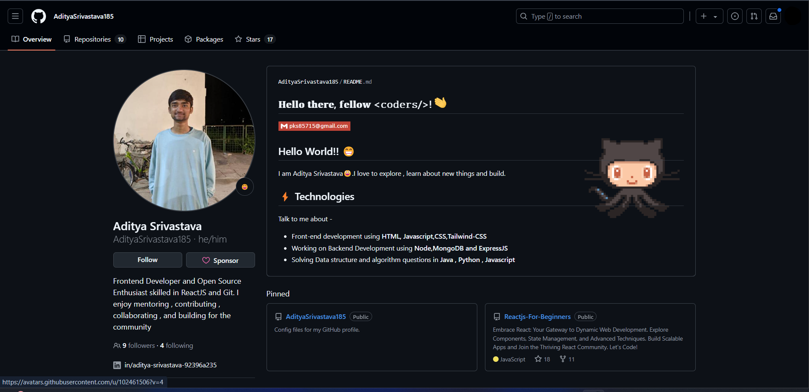
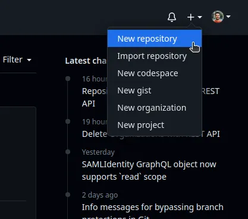
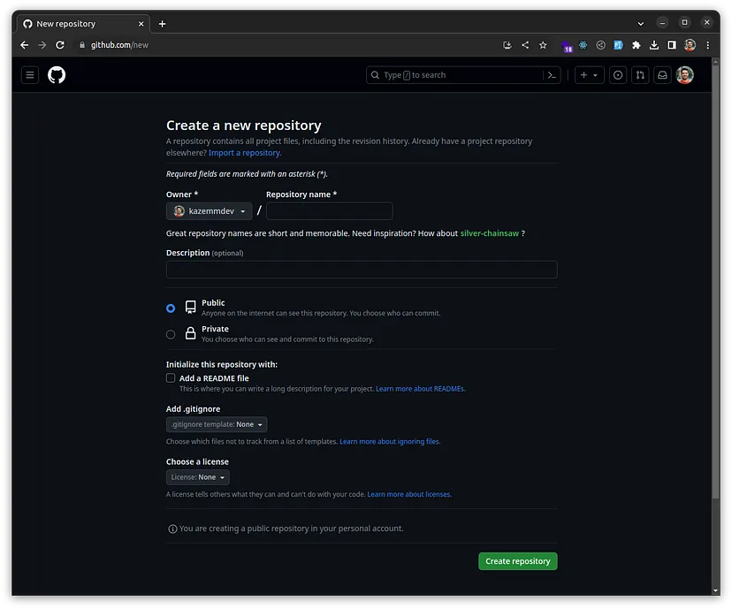
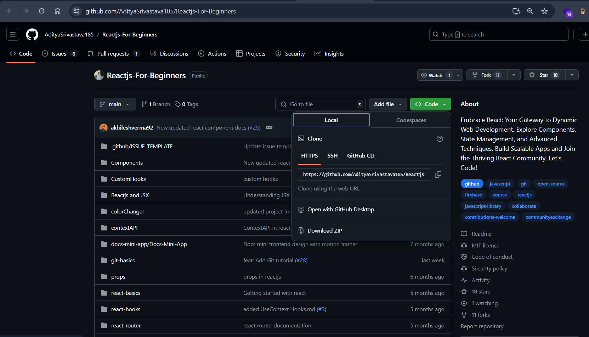
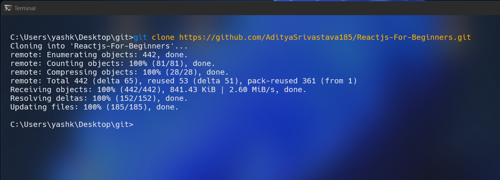
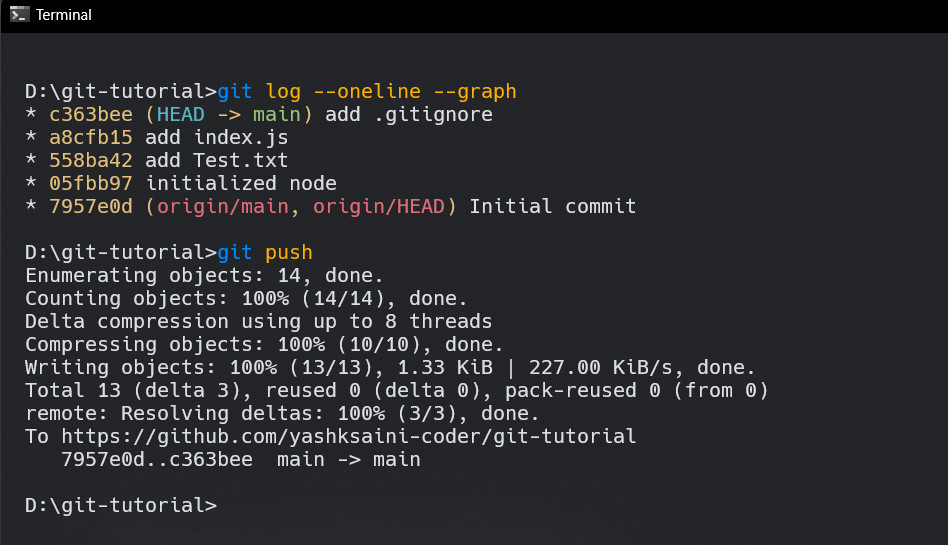
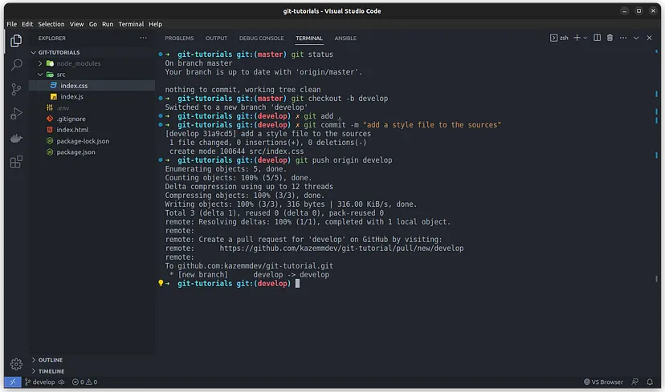
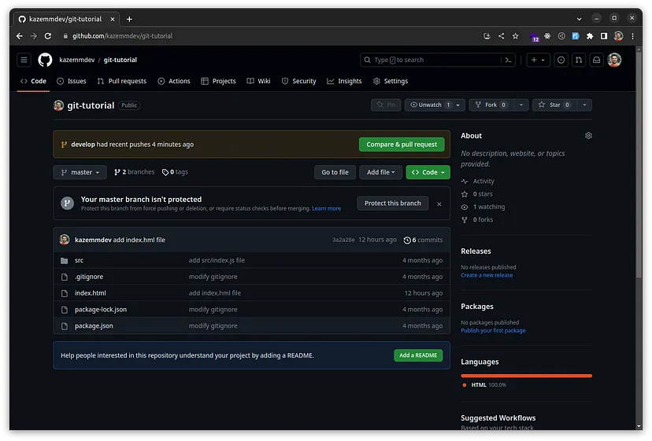
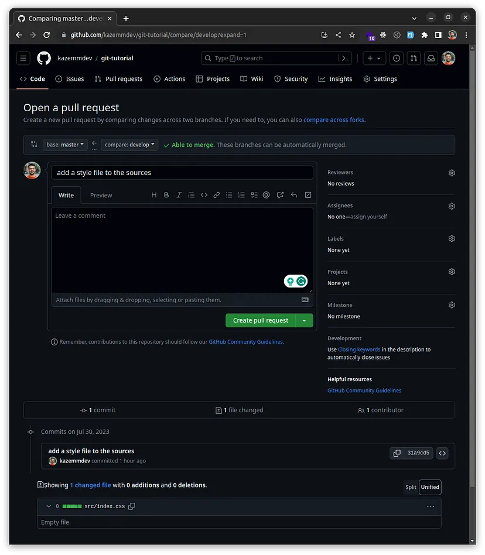
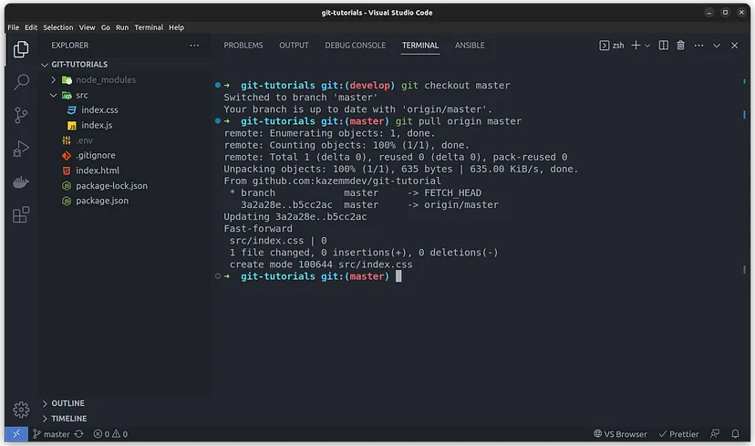

<div style="text-align: center;">
    
</div>
<br>

# GitHub

GitHub is a web-based platform that provides hosting for software development version control using Git. It is widely used for hosting and collaborating on software projects. GitHub lets developers store their projects on an external server (in the cloud!). This means they can work on their projects from any computer they want, and easily share their work with the rest of the team.

If you want to start using GitHub, you’ll need to create an account. Click [GitHub](https://github.com/join) to create an account and get started immediately!

## Table of Contents

1. [What is GitHub?](#what-is-github)
2. [How to Create a Repository](#how-to-create-a-repository)
3. [How to Clone a Repository](#how-to-clone-a-repository)
4. [How to Push Changes](#how-to-push-changes)
5. [How to Pull Changes](#how-to-pull-changes)
6. [Publishing a New Branch](#publishing-a-new-branch)
7. [Submit a pull request on GitHub](#submit-a-pull-request-on-github)
8. [Pull changes from GitHub](#pull-changes-from-github)
9. [Forking a Repository: Joining the Community](#forking-a-repository-joining-the-community)

## What is GitHub?

GitHub is a web-based platform that uses Git for version control, enabling developers to host, manage, and collaborate on code repositories. It supports features like branching, pull requests, issue tracking, and automation through GitHub Actions, making it a popular tool for software development and open-source contributions.

Key-benefits of using GitHub:

- **Version Control**: GitHub uses Git for version control, allowing developers to track changes and collaborate on code effectively.
- **Repositories**: Centralized spaces for storing project files and documentation. Repos can be public or private.
- **Branching**: Allows you to work on different features or bug fixes without affecting the main codebase.
- **Pull Requests (PRs)**: A process for reviewing and merging changes from one branch to another. Enables collaboration and code review.
- **Issues and Discussions**: Tools for tracking bugs, proposing features, and facilitating project communication.
- **GitHub Actions**: Automates workflows, such as building and testing code.
- **Forking**: Enables users to copy a repository and make independent changes.
- **GitHub Pages**: Hosts static websites directly from a GitHub repository.
- **Collaborators & Permissions**: Assign team roles and set access levels for project contributors.
- **Open Source Contributions**: Many projects are open source, allowing anyone to contribute.

<div style="text-align: center;">
    
</div>
<br>

## How to Create a Repository

To create a new repository on GitHub, follow these steps:

1. Go to GitHub.com and log in to your account.
2. Click the "+" button in the top-right corner and select "New repository".
3. Enter a repository name, description, and other details.
4. Choose whether the repository will be public or private.
5. Click "Create repository".

Your new repository will be created, and you can start adding code and collaborating with others!

<div style="text-align: center;">
    
</div>
<br>

You can also set what type of repository you want to create. You can choose between: 

- **Private**: Only you can access the repository.
- **Public**: Everyone can access the repository.

<div style="text-align: center;">
    
</div>
<br>

If you make it public, it’ll be visible to anyone. Just remember, if you’re sharing your code, make sure there isn’t any personal or important info you don’t want others to see. If you keep it private, you can pick who gets to access it.

## How to Clone a Repository

Now, it’s time to clone a repository from GitHub and work on it on our own system. To do this, we need to create a new directory on our system and download or clone the desired repository.

To get started, go to the GitHub repository you want to clone and click on the “Clone” button. From the drop-down menu, click on the copy button shown in the image (although it’s also possible to download the repository directly, we’ll be using Git here).

<div style="text-align: center;">
    
</div>
<br>

Next, navigate to the desired directory on your system and use the following command to clone the repository:

```bash
git clone <repository url>
```

This will download the repository to your local system and create a new directory with the same name as the repository. You can now make changes to the files in the directory and push those changes back to the remote repository on GitHub.

<div style="text-align: center;">
    
</div>
<br>

## How to Push Changes

Now, it’s time to push changes to the remote repository on GitHub. To do this, we need to add the changes to the staging area and then commit the changes to the local repository. Finally, we need to push the changes to the remote repository on GitHub.

```bash
git push
```

This will push the changes to the remote repository on GitHub.

<div style="text-align: center;">
    
</div>
<br>

## How to Pull Changes

Now, it’s time to pull changes from the remote repository on GitHub. To do this, we need to use the following command:

```bash
git pull
```

This will pull the changes from the remote repository on GitHub.


## Publishing a New Branch

When working with remote repositories, it's crucial to maintain a stable and executable codebase in the master/main branch. To achieve this, follow these best practices:

1. **Create a separate branch for new features or changes:**
   - Avoid pushing untested or buggy code directly to the master branch.
   - Develop new features or make changes on a separate branch.

2. **Work locally on your new branch:**
   - Make and test your changes in your local environment.
   - Ensure your code is functioning as expected before pushing to the remote repository.

3. **Push your new branch to the remote repository:**
   - Once your local changes are ready, push your new branch to GitHub.
   - Use the command: `git push -u origin <your-branch-name>`

<div style="text-align: center;">
    
</div>
<br>

4. **Create a Pull Request:**
   - After pushing your branch, create a Pull Request on GitHub.
   - This allows team members to review your changes before merging into the master branch.

<div style="text-align: center;">
    
</div>
<br>

5. **Review and merge:**
   - Project managers or team leads can review the changes in the Pull Request.
   - Once approved, the changes can be merged into the master branch.

By following this workflow, you ensure that:
- The master branch always contains stable, production-ready code.
- Changes are reviewed before being incorporated into the main codebase.
- Collaboration and code quality are improved through the review process.

Remember, creating a new branch was covered in the previous article. Refer to that section for detailed instructions on branch creation.


## Submit a pull request on GitHub

After pushing your branch to GitHub, you'll typically see a "Compare & Pull Request" button. Here's how to proceed:

   - Click on the "Compare & Pull Request" button.
   - You'll be directed to a new page where you can create your pull request:
     - Provide a suitable title for your pull request.
     - Write a necessary description explaining your changes.
     - Review the detailed list of changes you've made.

<div style="text-align: center;">
    
</div>
<br>

Once submitted:
   - Team members can review your commits and provide feedback on the pull request page.
   - The repository manager or authorized team member can merge your changes into the main branch.

   Additional PR options:
   - On the right-hand side column, you can:
     - Assign specific team members (Assignees)
     - Request reviews from team members (Reviewers)
     - Add Labels to categorize the PR
     - Link the PR to specific issues

> Note: Always provide clear descriptions and context in your pull requests to facilitate efficient review and collaboration.    

## Pull changes from GitHub

In team projects, it is common to encounter a situation where the remote repository on GitHub does not match the local repository on your computer, especially after making changes or merging branches through pull requests. To resolve this issue, you can use the “git pull” command to fetch the most recent changes from the GitHub repository and update your local repository accordingly.

```bash
git pull
```

<div style="text-align: center;">
    
</div>
<br>

This will fetch the most recent changes from the GitHub repository and update your local repository accordingly.

## Forking a Repository: Joining the Community

GitHub hosts a vast array of public and private projects. Forking a repository allows you to:

1. Use an existing project as a starting point for your own work
2. Contribute to open-source projects, gaining valuable experience and enhancing your resume

### How to Fork a Repository

1. Navigate to the GitHub repository you want to fork
2. Click the "Fork" button in the top-right corner of the page
3. GitHub will create a copy of the repository in your account

### Example: Forking the git-tutorial Repository

The git-tutorial repository is a sample project created for testing purposes. To fork it:

1. Visit [https://github.com/yashksaini-coder/git-tutorial](https://github.com/yashksaini-coder/git-tutorial)
2. Click the "Fork" button on the top right corner of the page
3. You'll now have a copy of the repository in your GitHub account

### Working with Your Forked Repository

To work on your forked repository locally:

1. Clone the repository to your local machine:
   ```
   git clone https://github.com/your-username/git-tutorial.git
   ```
2. Make changes as desired
3. Commit and push your changes to your GitHub fork.

### Adding Upstream Repository

To keep your forked repository in sync with the original repository:

1. Add the original repository as a remote:
   ```
   cd git-tutorial
   ```
2. Add the original repository as a remote:
   ```
   git remote add upstream https://github.com/yashksaini-coder/git-tutorial.git


    
### Fetching Changes from the Upstream Repository

To fetch the latest changes from the original (upstream) repository:

1. Fetch the latest updates from upstream:
    ```
    git fetch upstream
    ``` 
2. Merge the changes into your local repository:
    ```
    git merge upstream/main
    ```
3. Push the changes to your GitHub fork:
    ``` 
    git push
    ```
4. Your forked repository is now up-to-date with the original repository.


### Contributing Back to the Original Project

If you want to contribute your changes back to the original project:

1. Create a new branch in your fork
    ```
    git checkout -b new-branch-name
    ```
2. Make your changes and commit them
    ```
    git commit -m "Description of changes"
    ```
3. Push the branch to your GitHub fork
    ```
    git push origin new-branch-name
    ```
4. Open a pull request from your fork to the original repository

Remember, forking is a great way to experiment with changes without affecting the original project!
